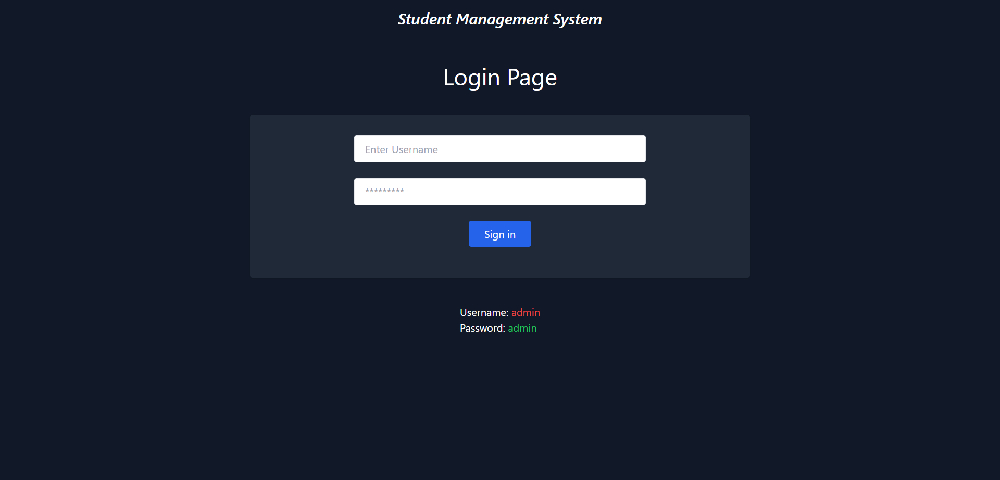
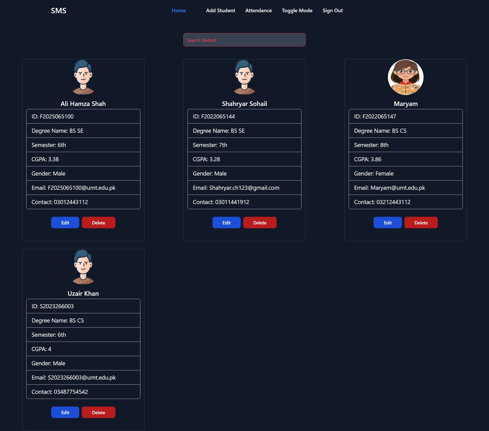
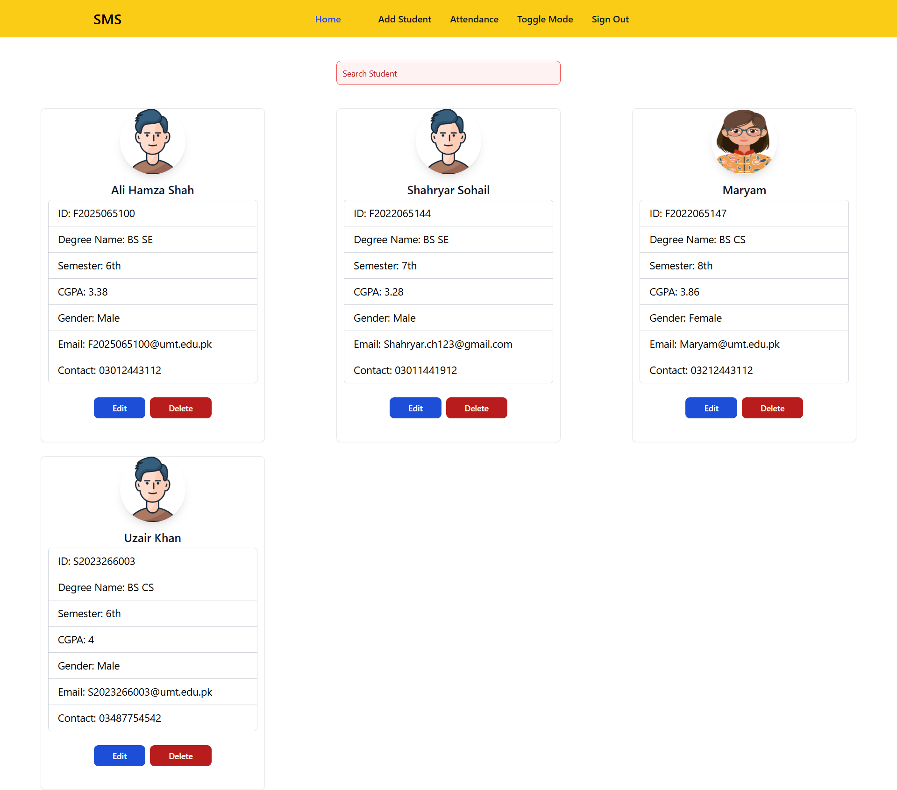
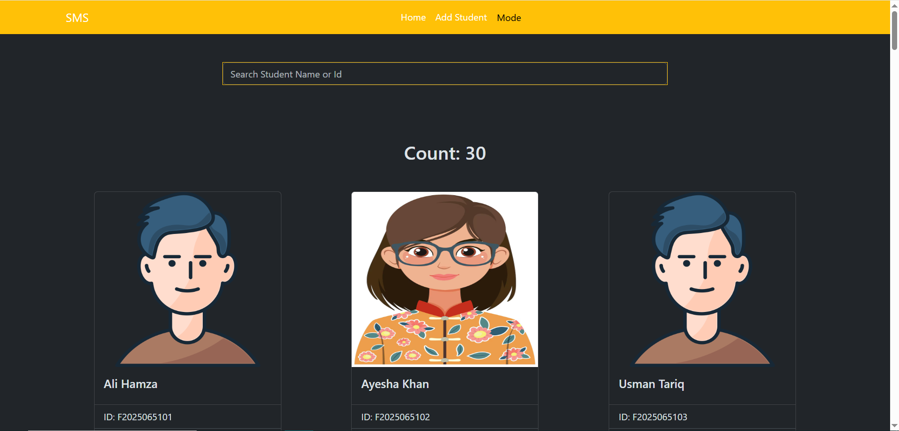
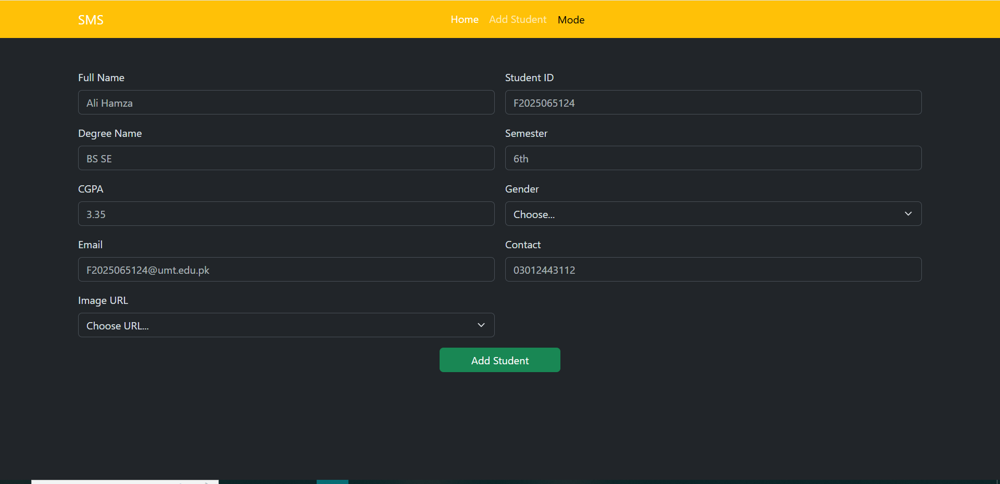
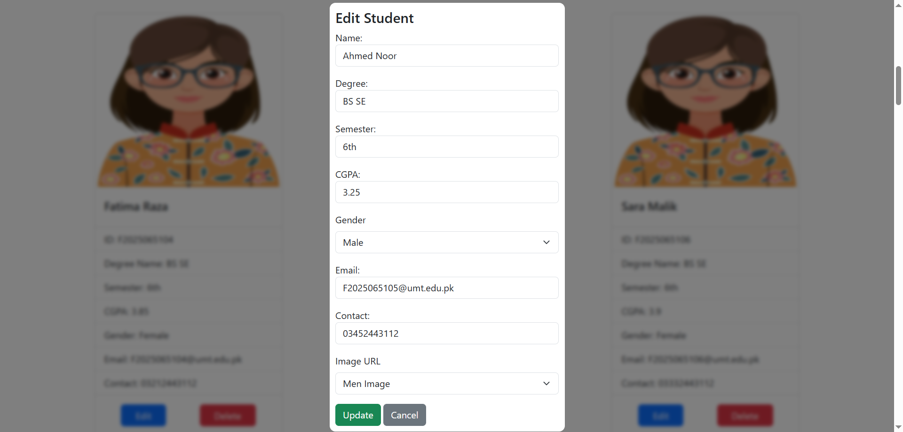
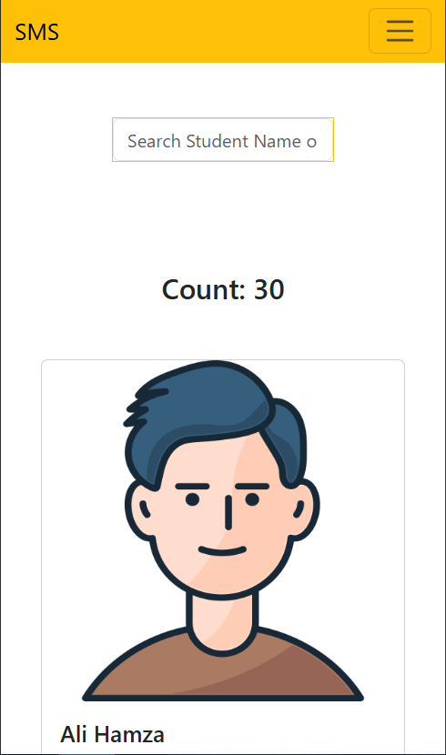
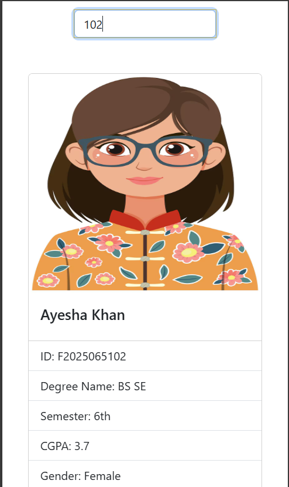

# 🎓 Student Management System

A simple project built using:

🚀 Tech Stack  
- 🧱 HTML  
- 🎨 CSS  
- 🎛️ Bootstrap  
- ⚙️ JavaScript  
- 🌐 Node.js  
- 🛠️ Express.js  

---

## 🛠️ How to Run This Project

### 1. 📥 Clone the Repository

```bash
git clone git@github.com:Shahryar-Sohail/StudentManagementSystem.git
```
### 2. 💻 Open in VS Code
Make sure you have VS Code installed.

### 3. 🔌 Install Live Server Extension
Install the Live Server extension from the VS Code Extensions Marketplace.

### 4. 🚀 Run the Project
Right-click on index.html

#### Select "Open with Live Server"

Your project will launch in the browser automatically! 🎉













